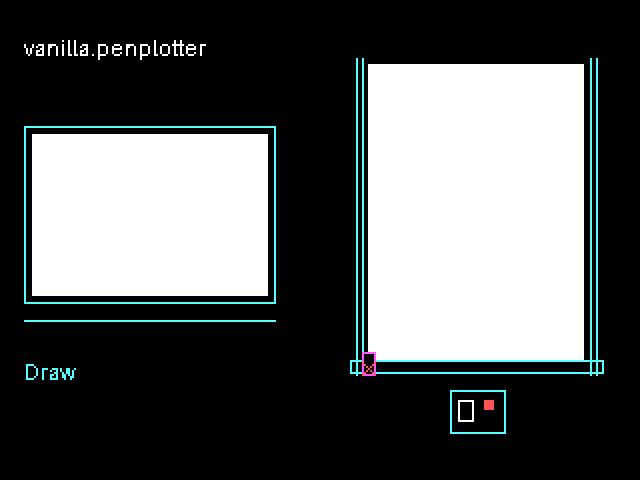
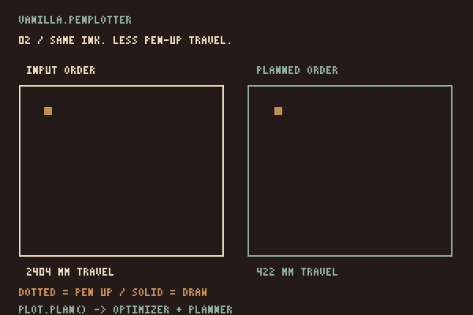

# vanilla.penplotter



**[Open site](https://seb-prjcts-be.github.io/vanilla.penplotter/)** · **[Examples](https://seb-prjcts-be.github.io/vanilla.penplotter/docs/examples.html)** · **[Possibilities](https://seb-prjcts-be.github.io/vanilla.penplotter/docs/possibilities.html)** · **[p5.penplotter](https://github.com/seb-prjcts-be/p5.penplotter)**

You supply polylines in physical units. This engine can clean up paths, plan a route, preview it and export files.

Its EBB driver can also plot a complete plan from the browser on the tested iDraw HSE / A2.

## Which library?

**vanilla.penplotter** is the engine. Use it for your own JavaScript, arrays of points or supported SVG geometry. It has no dependencies and works without p5.js.

**[p5.penplotter](https://github.com/seb-prjcts-be/p5.penplotter)** connects this engine to p5.js. Use it when you want to draw with supported p5 shapes and send them to the pen with `plot.go()`.

The libraries prepare a complete drawing before plotting. Live streaming is not implemented; [live drawing notes](https://seb-prjcts-be.github.io/vanilla.penplotter/docs/live.html) describe the proposed direction.

**Direct plotting is physically tested on one profile:** iDraw HSE / A2, EBB firmware 3.0.2, over Web Serial in Chrome or Edge. SVG, HPGL and G-code exports need software and settings suited to the receiving machine.

The version field is **0.3.1**. The [architecture](https://seb-prjcts-be.github.io/vanilla.penplotter/docs/architecture.html) describes the current implementation. Proposed work is on the [roadmap](https://seb-prjcts-be.github.io/vanilla.penplotter/docs/roadmap.html).

## Install

The site uses current source. The latest tags are core `v0.3.1` and adapter `v0.2.1`; newer `pen()`, `drawRoute()` and bed preview helpers are available on `main`, not in all tagged builds.

```html
<script type="module">
  import { PlotterEngine } from "https://cdn.jsdelivr.net/gh/seb-prjcts-be/vanilla.penplotter@v0.3.1/vanilla.penplotter.js";
</script>
```

The root module imports its own `src/` folder, so load it from somewhere that serves the whole repository: the jsDelivr tag above, GitHub Pages (`https://seb-prjcts-be.github.io/vanilla.penplotter/vanilla.penplotter.js`, always the latest `main`), or a local clone. Pin the tag for anything you want to keep.

## To the pen

```js
import { PlotterEngine } from "./vanilla.penplotter.js";
import { EbbDriver, createWebSerialTransport } from "./src/driver/ebb.js";

const plot = new PlotterEngine({ units: "mm", page: { width: 210, height: 297 } });
plot.line(20, 30, 190, 30);
plot.circle(105, 145, 48);

const plan = plot.plan();             // the iDraw's speeds and ramps, unless you say otherwise
console.log(plan.stats);              // paths, travel, pen lifts, estimated seconds

const transport = createWebSerialTransport();
await transport.open();               // from a click: the browser shows its port list
const driver = new EbbDriver({ transport, profile: "idraw-hse-a2" });
await driver.run(plan, { confirmed: true });
```

### Before plotting

A few things I learned the hard way, so you do not have to:

- The machine has no home position. Park the carriage in the home corner by hand before you start; that spot is 0,0 of the plan.
- The machine's X runs along the long rail, so a portrait sheet drawn on screen lies sideways on a portrait sheet on the bed. The pen panel of every example shows the bed as the machine sees it (home, the sheet at its offsets, the drawing inside) and has "Turn on the bed" (0, 90, 180, 270°), so what you see there is what lands on paper.
- Nothing is sent before every point has been checked against the bed, and units have to be mm, cm or inches.
- `driver.abort()` and errors attempt the same stop sequence: motion stopped, pen up, motors off. Delivery depends on a working connection. While a plot runs, every link that leaves the page is greyed out; whoever leaves anyway gets the browser's "leave site?" question first, and if the page goes the panel attempts stop, pen up, motors off in one last write (`driver.emergencyStop()`).
- An interrupted plot can go on where it stopped: every pen-up in the compiled list says which stroke it completes, and `compileEbbPlan(plan, { skipDraws: n })` leaves the first `n` strokes out and starts from home, where you park the carriage again by hand. The pen panel of every example remembers the count and offers "Resume at stroke n".
- `compileEbbPlan(plan)` gives you the exact command list without sending it; `createLogTransport()` is the dry run. Do one the first time.
- Web Serial only exists in Chrome and Edge, on `localhost` or https.

### Motion

Pen-up travel uses timed `SM` steps along the planned ramp. Drawing uses `LM` on supported firmware; older firmware uses timed steps for both.

Motion is planned with acceleration: every stroke ramps up from rest, cruises, slows into corners by how sharp they are, and ramps down again. The plan's `drawSpeed` and `travelSpeed` are the speeds the machine gets; the profile fills in the rest (40 mm/s drawing and travelling, 800 mm/s² drawing and 300 mm/s² travelling, a corner deviation of 0.05 mm), and every value can be overridden in `compileEbbPlan(plan, { drawSpeed, travelSpeed, acceleration, travelAcceleration, junctionDeviation })` or `driver.run(plan, { ... })`.

A stroke never aims at exactly zero speed (floor 2 mm/s, so the last step of a line is never left hanging with the pen on the paper), chords within 0.02 mm of a straight line are merged before planning (a circle of 360 chords is a few dozen commands, not 360), and commands go out ahead of their acknowledgements, so a run of short moves is never paced by the USB round trip.

On firmware 3.x the driver also opens the board's motion queue to its full depth.

The planner's estimate uses the same speeds, the same ramps and the same pen delays, so the seconds in `plan.stats` are the seconds the pen panel shows and, on the iDraw, the seconds the plot takes: 681 estimated, 680 plotted, for the wave hatch.

**We test on one machine only: the iDraw HSE / A2 with EBB firmware 3.0.2.** Axes and scale were measured on paper on 2026-09-21; the acceleration planning, the `LM` moves and the deep motion queue were plotted on 2026-10-01. The iDraw HSE/A3 and standard-servo AxiDraw models are likely candidates, not tested profiles. NextDraw needs its own pen-lift and homing configuration. See the [machine notes](docs/architecture.html).

`EBB_PROFILES["idraw-hse-a2"]` keeps the manufacturer's defaults separately from the operating settings. Pen heights and lift rates remain unchanged unless you pass `penLift: { up: 60, down: 30, raiseRate: 75, lowerRate: 50 }` to `compileEbbPlan()` or `driver.run()`. These are percentages for the profile's standard servo, not millimetres; check the installed pen lift and mounting first. `EBB_COMPATIBILITY` lists the researched candidates and source links, without selecting a machine automatically.

## Requirements

<!-- vereisten:start -->
| component | requires | note |
|---|---|---|
| `vanilla.penplotter` | nothing | no dependencies; works without p5.js. Node ≥ 18 only to run the tests |
| `p5.penplotter` | vanilla.penplotter ≥ 0.2.0 | the adapter contains no plotting or machine code; with a driver attached it refuses an older core with a clear message |
| `p5.penplotter` | p5.js ≥ 2.2.2 | tested with 2.2.2, in global and instance mode |
| direct plotting | Chrome or Edge, on `localhost` or https | Web Serial; the browser shows its port list only after a click or keypress |
| direct plotting | iDraw HSE / A2 with EBB firmware 3.0.2 | the only physically tested profile (`idraw-hse-a2`) |
| examples | wave formulas, vanilla.waves (pinned commit) | examples only; neither library depends on them |

Tested together: `vanilla.penplotter` 0.3.1 with `p5.penplotter` 0.2.1.

Publishing: always `vanilla.penplotter` first, then `p5.penplotter`. The examples of
`p5.penplotter` load the core as a sibling folder (`../vanilla.penplotter/`), locally under
`htdocs` and online on GitHub Pages. They therefore always get the latest core, not a
pinned one; the version check refuses a core below the required minimum.
<!-- vereisten:end -->

## The facade

`PlotterEngine` is one object that holds a document and rebuilds its plan whenever the document changes.

| method | what it does |
|---|---|
| `line`, `polyline`, `polygon`, `rect`, `circle`, `arc` | add paths to the active layer, in document units |
| `hatch`, `crossHatch`, `stipple` | fill a polygon with lines or seeded dots (`spacing`, `angle`, `count`, `minDistance`, `seed`) |
| `pen({ id, color, width })` (also `tool()`), `layer(id, { toolId })` | pens and layers; layers stay in document order; a changed tool requests a pen swap |
| `importSVG(text)` | paths, lines, polygons, rects, circles and nested transforms; curves flattened |
| `optimize({ passes, mergeTolerance, duplicateTolerance, simplifyTolerance, maxSegmentLength })` | deduplicate, merge, simplify, resample, clean |
| `plan({ strategy, drawSpeed, travelSpeed, acceleration, travelAcceleration, liftDelay, toolChangeDelay })` | `"nearest"`: greedy nearest-path routing, with reversal and closed-path reloop; `"drawn"`: the order you drew |
| `stats()` | paths, points, draw and travel distance, pen lifts, pen changes, estimated seconds |
| `drawRoute(context, { showTravel })` | the route on a canvas, the pen in the air in red (also `drawPreview`) |
| `drawBed(context, { bed, sheet })` | the bed as the machine sees it: the home corner, the sheet where it lies, the drawing on it |
| `exportSVG`, `exportHPGL({ penMap, unitsPerMm })`, `exportGCode({ penUp, penDown })`, `exportJSON` | the same plan as a file, for machines without a driver |

The shared pen panel in the examples lets you choose A0–A6 or keep the drawing’s page, turn the sheet and drawing together, and centre the paper on the bed. Paper choice preserves stroke size. A sheet outside the bed or strokes outside the sheet block plotting; export links retain the original drawing before placement.

`PlotterEngine.paperSize(format, orientation, units)` exposes the same A0–A6 helper as the named `paperSize()` export. Adapters use it without copying a second size table. The p5 adapter uses it for `createPlot({ paper: "A2", margin: 12 })`.

## Planning the route

<p align="center">
  
</p>

The marks stay the same; the order changes. `plan({ strategy: "nearest" })` uses greedy nearest-path routing. Use `"drawn"` when the order you drew matters.

## Every stage on its own

```js
import { createDocument, addLayer } from "./src/core/model.js";
import { line } from "./src/geometry/index.js";
import { optimizeDocument } from "./src/optimizer/index.js";
import { planDocument } from "./src/planner/index.js";
import { compileEbbPlan } from "./src/driver/ebb.js";

const document = createDocument({ units: "mm" });
const layer = addLayer(document, { id: "blue", toolId: "pen-blue" });
line(layer, 10, 10, 100, 40);

const optimized = optimizeDocument(document, { mergeTolerance: 0.05 });
const plan = planDocument(optimized, { strategy: "nearest" });
const commands = compileEbbPlan(plan, { profile: "idraw-hse-a2" }).commands;
```

Every stage accepts and returns plain, JSON-serialisable snapshots: `vanilla.penplotter/document@1` in, `vanilla.penplotter/plan@1` out. No stage mutates its input.

## Structure

- `vanilla.penplotter.js`: root entry and the `PlotterEngine` facade
- `src/core/`: documents, layers, tools, paths and validation
- `src/geometry/`: primitives, fills, offsets, transforms and SVG import
- `src/optimizer/`: merging, deduplication, simplification and resampling
- `src/planner/`: drawing order, pen moves, statistics and time
- `src/renderer/`: canvas preview, and SVG, HPGL, G-code and JSON for other machines
- `src/driver/`: machine profiles, simulation, a text transport and the EBB driver that plots directly
- `src/plugins/`: extension points for effects, optimizers, renderers and drivers
- `index.html`, `docs/`, `examples/`: the GitHub Pages site; `examples/pen.js` is the shared "to the pen" panel every example uses

## Examples

Every example ends at the pen; the [examples page](https://seb-prjcts-be.github.io/vanilla.penplotter/docs/examples.html) previews them live.

- `direct_plot` - a 40 × 25 mm frame with two waves: the first thing to plot, and a scale check
- `first_job` - a hatched shape, its outline and a circle: the smallest complete job
- `two_pens` - layers and tools; the plot pauses once so you can swap the pen
- `route_lab` - input made bad on purpose; switch optimizer passes on and off and read what each one buys
- `waves_pen` - 32 lines from vanilla.waves, sampled at a fixed time: a still from an animation
- `wave_hatch` - seventy cells hatched at a spacing and angle two waves decide: tone from lines
- `svg_to_pen` - supported SVG paths and basic shapes fitted to a width, previewed and plotted

## Behaviour and limits

**Edits.** After every change, through the drawing methods, `tool()`, `layer()`, `importSVG()` or directly in `plot.document` and returned paths or layers, planning, statistics, preview and export rebuild the plan with the last optimisation and planning settings. A plan returned earlier stays a separate snapshot. The check compares the whole document on every call, so document data must stay JSON-serialisable.

Measured: about 5 ms at 11 000 points, 20 ms at 50 000, 230 ms at 500 000. Negligible for one plot; do not redraw a huge plan as a preview every frame.

**Units.** Coordinates, tolerances and distance statistics are in the document unit. Plan speeds are mm/s, G-code feeds mm/min. HPGL and G-code export and the time estimate convert mm, cm, inch and CSS pixels (96 px per inch) to physical sizes; SVG keeps the document unit. Direct plotting accepts only mm, cm and inch.

**Geometry.** SVG import and the geometric effects are good for experiments, not yet for every SVG/CSS, compound-path and self-intersection case.

**Hardware.** `WebSerialTextDriver` is a low-level transport for text protocols, not a machine driver. `EbbDriver` is one, but only for the profile it has been tested on; every other profile stays experimental until there are hardware tests. Direct plotting always requires an explicit confirmation.

## Related work

[p5.plotSvg](https://github.com/golanlevin/p5.plotSvg) by Golan Levin is the usual way to export a plotter-friendly SVG from p5.js. It deliberately does not optimise and drives no machine; for that it points to [vpype](https://vpype.readthedocs.io/). This engine starts where that road ends: it reads such a file, plans it and plots it (the `svg_to_pen` example).

[p5.gysin](https://github.com/seb-prjcts-be/p5.gysin) writes plotter-safe SVG with one Inkscape layer per pen; this engine can read it. Wave samplers and [vanilla.waves](https://github.com/seb-prjcts-be/vanilla.waves) supply the numbers several examples draw with.

## Test

```powershell
npm test
npm run docs
npm run manifest
```

`npm test` runs the snapshot, driver, regression and version tests, checks every local link on the site, builds every example composition and live preview headlessly, and fails when a generated docs page is stale. `npm run docs` renders `docs/architecture.md` and `docs/roadmap.md` to HTML; `npm run manifest` regenerates `docs/vanilla.penplotter.manifest.json`.

The optional vanilla.waves check stays off the network: download `waves-core.js` from vanilla.waves commit `4fad55570d9dab243e99f40181f12b5aede2c5be` and run:

```powershell
node tests/waves-integration.js path/to/waves-core.js waves-a4.svg
```

## How this was made

Designed and directed by Sebastien Vanblaere, written with AI assistance, and held to one rule: nothing is claimed that a test or a plot on paper has not shown. See [About](https://seb-prjcts-be.github.io/vanilla.penplotter/docs/about.html).

MIT License.

Sebastien Vanblaere
